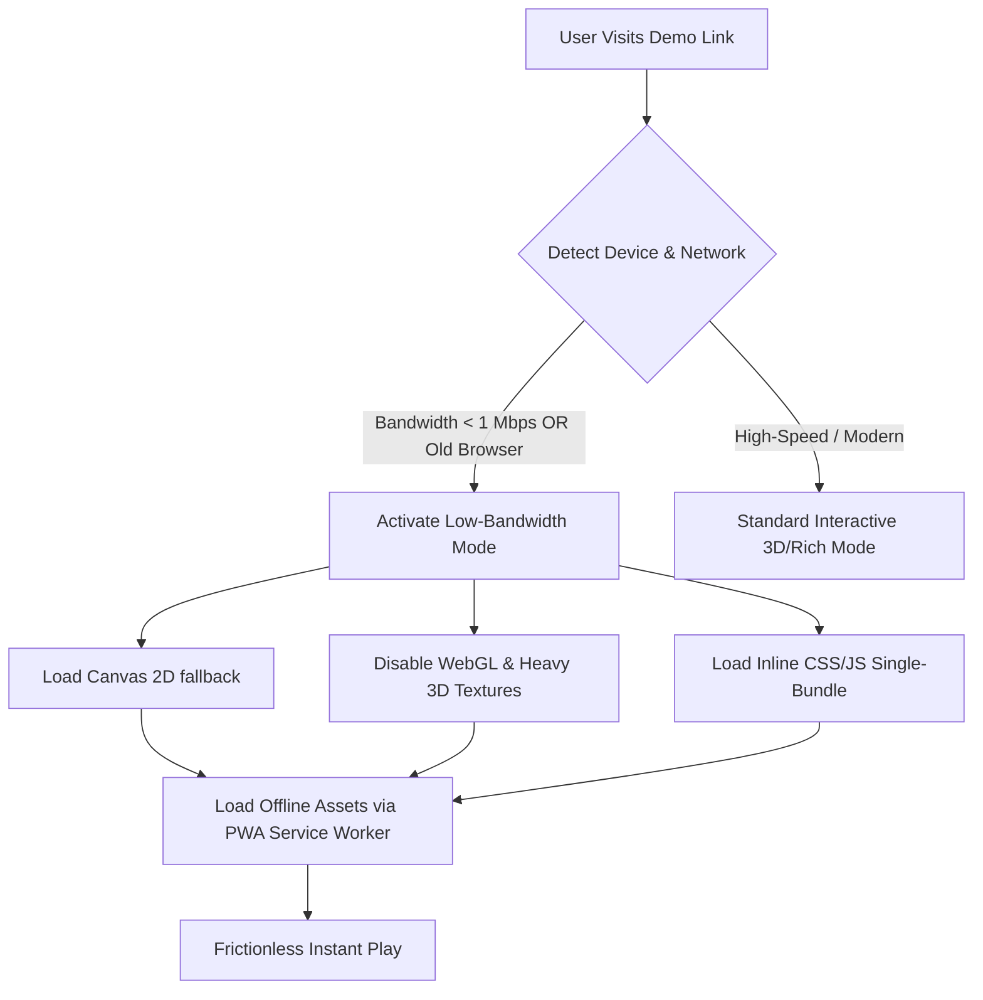

# Day 25 – Target Institutional Pipeline & Pilot Agreement Framework

## Objective

The objective of Day 25 was to transition from customer discovery design to execution prep. This involved:
1. Building a targeted pipeline of 35 educational institutions in Jammu & Kashmir (J&K) and Delhi NCR to initiate pilot outreach.
2. Creating a formal "Pilot Program Agreement" (MOU Framework) to establish clear commitments, resource requirements, and success metrics for participating schools.
3. Architecting a detailed technical specification for a "Low-Bandwidth Demo Mode" to address institutional hardware and internet connectivity challenges.

---

## Target Institutional Pipeline (35 Institutions)

To focus our outreach, we have identified a high-priority pipeline of 35 institutions across J&K and Delhi NCR. These are segmented by institutional type, location, estimated size, and their specific alignment triggers (e.g., NEP compliance, laboratory resource shortage, accreditation goals).

| Pipeline ID | Institution Name | Location | Type | Curriculum / Affiliation | Est. Science Students (Per Batch) | Strategic Trigger / Entry Point |
|---|---|---|---|---|---|---|
| **01** | Delhi Public School (DPS) | Srinagar, J&K | School | CBSE | 180+ | High focus on smart-classroom branding and NEP 2020. |
| **02** | Tyndale Biscoe School | Srinagar, J&K | School | JKBOSE / CBSE | 120+ | Heavy focus on practical learning; science lab upgrade cycle. |
| **03** | Presentation Convent Sec. School | Srinagar, J&K | School | CBSE | 100+ | Interest in interactive STEM tools for girl students. |
| **04** | Burn Hall School | Srinagar, J&K | School | JKBOSE | 90+ | Traditional science school seeking digital engagement options. |
| **05** | Mallinson Girls School | Srinagar, J&K | School | JKBOSE | 110+ | Digital classroom modernization under NEP 2020 directives. |
| **06** | Army Public School (APS) | Srinagar, J&K | School | CBSE | 150+ | Highly standardized CBSE curriculum; budget for digital aids. |
| **07** | Kendriya Vidyalaya (KV) No. 1 | Srinagar, J&K | School | CBSE | 140+ | Government-backed KV seeking high-quality interactive labs. |
| **08** | Green Valley Educational Inst. | Srinagar, J&K | School | JKBOSE | 200+ | Large private institution; strong interest in digital branding. |
| **09** | Foundation World School | Humhama, J&K | School | Cambridge / CBSE | 80+ | International curricula require high-fidelity simulations. |
| **10** | DPS Jammu | Jammu, J&K | School | CBSE | 190+ | Competitive market; seeking state-of-the-art virtual aids. |
| **11** | KC Public School | Jammu, J&K | School | CBSE | 130+ | Smart-lab credentials to maintain premium branding. |
| **12** | Heritage School | Jammu, J&K | School | CBSE | 120+ | Interactive digital learning initiatives for senior secondary. |
| **13** | Presentation Convent School | Jammu, J&K | School | CBSE | 90+ | STEM curriculum enhancement program. |
| **14** | Army Public School | Jammu, J&K | School | CBSE | 160+ | Seeking structured board-exam practical preparation tools. |
| **15** | SRM Welkin Higher Sec. School | Sopore, J&K | School | JKBOSE | 250+ | Large district-level school experiencing lab overcrowding. |
| **16** | Iqbal Memorial Institute | Srinagar, J&K | School | JKBOSE | 120+ | Traditional school seeking to improve board practical scores. |
| **17** | Saint Paul's Academy | Ghaziabad, NCR| School | ICSE | 110+ | ICSE syllabus has a heavy practical focus; seeking virtual aids. |
| **18** | Amity International School | Noida, NCR | School | CBSE | 220+ | Strong STEM/Robotics budget; looks for proprietary tech pilots. |
| **19** | DPS R.K. Puram | New Delhi | School | CBSE | 350+ | Premier school; pilot acts as a powerful regional case study. |
| **20** | Modern School, Barakhamba Rd. | New Delhi | School | CBSE | 280+ | Premium school looking for bespoke academic integration. |
| **21** | Apeejay School | Noida, NCR | School | CBSE | 150+ | Focuses on student performance analytics for board exams. |
| **22** | Pathways World School | Gurgaon, NCR | School | IB / CBSE | 100+ | Direct replacement/companion for premium physics resources. |
| **23** | Ryan International School | Noida, NCR | School | CBSE | 180+ | Standardized smart-lab package rollouts. |
| **24** | GD Goenka Public School | Sector 48, GGN | School | CBSE | 140+ | Focus on parent-facing digital features and analytics. |
| **25** | Shiv Nadar School | Gurgaon, NCR | School | CBSE | 120+ | Technology-first curriculum; strong software budget. |
| **26** | National Institute of Tech (NIT) | Srinagar, J&K | College | Engineering | 450+ (1st Year) | NAAC/NIRF accreditation preparation; lab prep efficiency. |
| **27** | SSM College of Engineering | Pattan, J&K | College | University of Kashmir | 300+ (1st Year) | High equipment-to-student ratio; needs virtual pre-lab preps. |
| **28** | IUST Awantipora | Pulwama, J&K | College | State University | 250+ (1st Year) | Seeking cost-effective engineering lab software solutions. |
| **29** | BGSBU Rajouri | Rajouri, J&K | College | State University | 180+ (1st Year) | Remote location; virtual labs overcome hardware access issues. |
| **30** | GCET Jammu | Jammu, J&K | College | State University | 200+ (1st Year) | Standardizing practical examination review mechanisms. |
| **31** | Yogananda College of Eng. & Tech| Jammu, J&K | College | State University | 150+ (1st Year) | Seeking branding boosts and accreditation documentation support. |
| **32** | Jamia Millia Islamia (Faculty of Eng)| New Delhi | College | Central University | 350+ (1st Year) | Large student batches; virtual pre-lab runs save lab hours. |
| **33** | Amity School of Eng. & Tech | Noida, NCR | College | Private University | 600+ (1st Year) | Large-scale enrollment; requires custom learning management. |
| **34** | Galgotias College of Eng. & Tech | Greater Noida | College | AKTU | 500+ (1st Year) | High volume student onboarding; needs lightweight web demos. |
| **35** | Sharda University (SET) | Greater Noida | College | Private University | 400+ (1st Year) | International student cohort; demands modern UI/UX. |

---

## Pilot Program Agreement Framework (MOU Template)

To formalize pilots and secure buy-in, we use a structured **Memorandum of Understanding (MOU)**. This document outlines responsibilities and positions the pilot as a pathway to a paid license.

```text
MEMORANDUM OF UNDERSTANDING (MOU)
FOR COOPERATIVE PILOT IMPLEMENTATION OF CIRCUIT.IQ VIRTUAL LABORATORY

This Memorandum of Understanding (hereinafter referred to as the "MOU") is entered into this ____ day of ____________, 2026, by and between:

CIRCUIT.IQ (hereinafter referred to as "the Developer"), represented by its Founder, Anayat Zahoor.
AND
[NAME OF INSTITUTION] (hereinafter referred to as "the Partner Institution"), located at [Address of Institution], represented by its Principal/Dean [Name of Representative].

1. PURPOSE & SCOPE
The purpose of this agreement is to run a structured, complimentary 4-week Pilot Program of Circuit.IQ, an AI-powered virtual physics laboratory, for selected batches of senior secondary / engineering physics students at the Partner Institution. The goal is to measure engagement, assess conceptual clarity improvements, and validate institutional fit.

2. RESPONSIBILITIES OF THE DEVELOPER
The Developer agrees to:
2.1 Provide complimentary web-based access to the Circuit.IQ virtual physics laboratory simulations for up to [Number] students and [Number] teachers.
2.2 Deliver a 1-hour virtual onboarding session for the Physics faculty.
2.3 Provide a Teacher Dashboard to the department head for progress monitoring.
2.4 Deliver a post-pilot Learning Outcomes Report summarizing student performance, conceptual gap analysis, and usage statistics.

3. RESPONSIBILITIES OF THE PARTNER INSTITUTION
The Partner Institution agrees to:
3.1 Designate a Coordinating Physics Teacher to act as the primary point of contact.
3.2 Ensure participating students complete:
    a) A baseline 10-minute conceptual quiz (Pre-Pilot).
    b) A minimum of two (2) virtual physics simulation assignments.
    c) A final 10-minute conceptual quiz (Post-Pilot).
3.3 Provide qualitative feedback via a structured 10-minute interview or survey upon completion.
3.4 Allow the Developer to refer to the Partner Institution as a "Pilot Partner" in academic case studies (without sharing sensitive student identities).

4. PILOT TIMELINE
- Week 1: Faculty onboarding and Pre-Pilot student registration & quiz.
- Week 2-3: Active student usage (guided assignments using Circuit.IQ).
- Week 4: Post-Pilot quiz, collection of teacher feedback, and report delivery.

5. DATA PRIVACY & COMPLIANCE
5.1 The Developer guarantees that no personal identifiable information (PII) of student minors will be shared, sold, or used for commercial marketing.
5.2 All student data generated during the pilot is securely encrypted and used solely for generating academic performance reports for the Partner Institution.

6. COMMERCIAL PATHWAY & RETENTION
Upon successful completion of the pilot, where the post-pilot report indicates positive student engagement and concept gap improvements:
6.1 The Developer will submit a formal commercial proposal for an annual institutional license.
6.2 The Partner Institution agrees to review the proposal and evaluate it within their upcoming budget approval cycle, with no pre-existing obligation to purchase.

IN WITNESS WHEREOF, the parties hereto have executed this MOU on the date first written above.

For Circuit.IQ:                                For Partner Institution:

_____________________________                 _____________________________
Anayat Zahoor                                 Name:
Founder, Circuit.IQ                           Title: Principal / Dean / Director
                                              [Institution Stamp]
```

---

## Technical Specification: "Low-Bandwidth Demo Mode"

### The Challenge
During customer discovery, we identified that many government and private school computer labs in J&K and Tier-2/3 cities have outdated desktop machines (often running Windows 7/10, dual-core CPUs, 2GB-4GB RAM) and internet connections shared across 30+ terminals, leading to actual bandwidths below **512 Kbps per user**.

### The Solution: Architecture Blueprint
To ensure the Circuit.IQ demo runs instantly without installation on these limited systems, we will implement a "Low-Bandwidth Demo Mode" targeting a sub-250KB initial payload and offline-capable rendering.



### Core Optimizations

#### 1. Core Bundle Size Optimization
- **Build Target**: Bundle code using Vite + ESBuild, outputting a single, self-contained HTML file for the demo containing inline CSS/JS to eliminate multiple HTTP handshakes.
- **Dependency Purging**: Avoid loading heavy framework modules (like Three.js or full react-three-fiber packages) for the low-bandwidth mode. Use vanilla SVG or HTML5 Canvas 2D context for simulation rendering.
- **Initial Chunk Budget**:
  - HTML & CSS: **30 KB**
  - Simulation Logic (Vanilla JS): **80 KB**
  - Minimal UI icons (Inline SVGs, no font files): **15 KB**
  - **Total Initial Payload: ~125 KB** (loads in under 2 seconds on a 512 Kbps connection).

#### 2. Rendering Pipeline Fallbacks
- **Browser Compatibility**: Fall back from WebGL/WebGL2 to lightweight HTML5 Canvas 2D context rendering.
- **Physics Engine**: Use simplified, closed-form algebraic approximations of physics equations (e.g., Ohm's law, lens formula calculations) run directly in JavaScript web workers instead of full rigid-body physics engines (like Ammo.js or Matter.js).
- **Resource Loading**: Pre-compile assets. Do not stream image resources; convert schematic diagrams to inline vector paths (SVG) styled dynamically via CSS variables.

#### 3. Offline-First PWA Implementation
- **Service Worker Cache**: Install a service worker that caches the entire demo bundle (`index.html` and core simulations) during the first load.
- **Offline Mode**: If the internet disconnects mid-session, the service worker serves the cached application, allowing the simulation to run offline.
- **Data Buffering**: Store all student inputs (quiz selections, simulation clicks) in `localStorage`. Buffer these payloads and queue them for sync when the browser detects that connection is restored.

---

## Summary of Learnings

During Day 25, I completed the preparation phase of Circuit.IQ's validation campaign. By mapping out a precise list of 35 target schools and engineering colleges, I have a clear database of prospects to reach out to. The Pilot MoU provides a structured, low-risk way to secure institutional partnerships, and the Low-Bandwidth Technical Specification addresses the most significant structural objection raised during target profile definition. The validation campaign is now ready to begin outreach.
