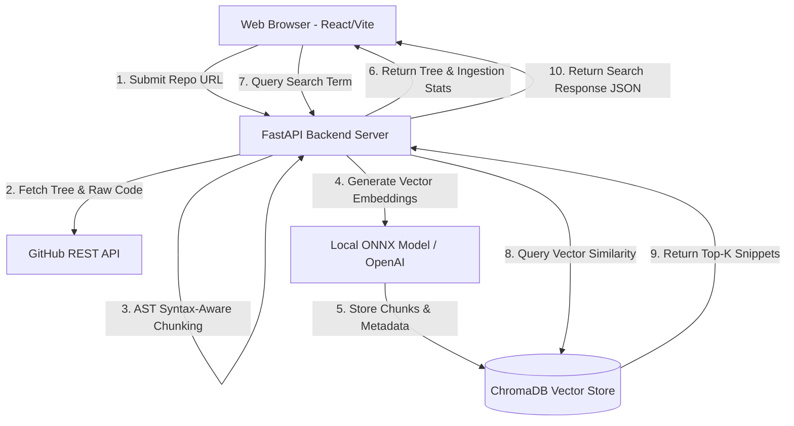

# System Architecture & Cloud Deployment Specifications (Day 5 Update)

This document specifies the system architecture, component data flows, and deployment configurations for **CodeCompass**.

---

## 1. System Architecture Diagram

---

## 2. Component Design & Responsibilities

### A. Frontend Layer (`frontend/`)
- Single Page Application built with React 18, Vite, and Tailwind CSS.
- Communicates with FastAPI backend over CORS-enabled HTTP endpoints (`http://localhost:8000`).
- Configured for Vercel deployment with URL rewrite rules in `vercel.json`.

### B. Ingestion Service (`backend/services/github_service.py`)
- Validates public GitHub repository URLs.
- Fetches directory trees recursively via GitHub REST API.
- Filters target source code files (`.py`, `.js`, `.ts`, `.jsx`, `.tsx`, `.html`, `.css`, `.json`, `.md`).
- Drops binary files, lockfiles, and ignored folders (`node_modules`, `.git`, `venv`).

### C. AST Code Splitter (`backend/services/chunker.py`)
- Uses `RecursiveCharacterTextSplitter.from_language()` to split code at syntax boundaries (classes, functions, blocks).
- Generates deterministic chunk IDs and attaches rich structural metadata (`file_path`, `language`, `repo`, `chunk_index`, `total_chunks`, `char_length`).

### D. Vector Database Service (`backend/services/vector_db.py`)
- Manages persistent ChromaDB vector store under `backend/chroma_db`.
- Operates 100% free with local ONNX embedding model (`all-MiniLM-L6-v2`), with optional fallback to OpenAI `text-embedding-3-small`.
- Handles batch upserts into `codecompass_chunks` collection and cosine similarity vector queries.

---

## 3. Cloud Production Deployment Architecture

| Tier | Component | Platform | Configuration File | Command / Strategy |
|---|---|---|---|---|
| **Backend** | FastAPI Python API | **Render** | `backend/Procfile` & `backend/render.yaml` | `uvicorn main:app --host 0.0.0.0 --port $PORT` |
| **Frontend** | React / Vite SPA | **Vercel** | `frontend/vercel.json` | Single Page Application rewrite to `/index.html` |
| **Vector DB** | ChromaDB Engine | Local / Server Disk | `backend/chroma_db` | Persistent local client storage |
